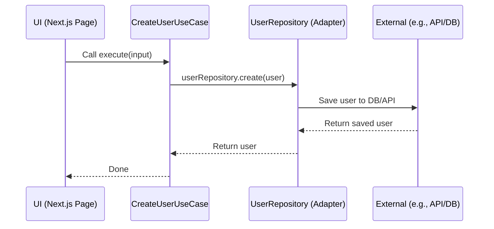
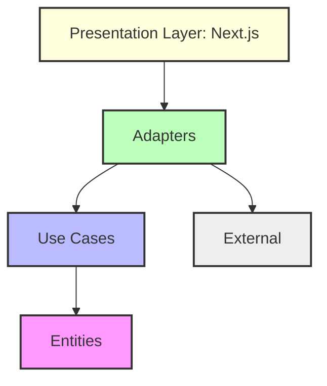

## SOLID Principles

This project follows SOLID principles:

- **S**ingle Responsibility: Each class/module has one responsibility.
- **O**pen/Closed: Code is open for extension, closed for modification.
- **L**iskov Substitution: Interfaces/abstractions are respected.
- **I**nterface Segregation: Small, focused interfaces.
- **D**ependency Inversion: High-level modules depend on abstractions.

## Strict Typing

- All code is written in TypeScript with strict mode enabled.
- Use of `zod` for runtime validation and type inference.
- All interfaces and types are explicit and enforced.

## Contributing

We welcome PRs that:

- Add new features or use cases
- Improve typing or validation
- Refactor for better SOLID/architecture
- Add tests or documentation

**Guidelines:**

1. Fork the repo and create a feature branch.
2. Follow the existing folder structure and conventions.
3. Write/extend tests for new features.
4. Ensure all code is strictly typed and validated.
5. Open a PR with a clear description.

## License

MIT
## Diagrams

### Clean Architecture Onion Diagram

```mermaid
flowchart TD
    UI[Presentation Layer (Next.js)] --> AD[Adapters]
    AD --> UC[Use Cases]
    UC --> EN[Entities]
    AD --> EX[External]
    style EN fill:#f9f,stroke:#333,stroke-width:2px
    style UC fill:#bbf,stroke:#333,stroke-width:2px
    style AD fill:#bfb,stroke:#333,stroke-width:2px
    style UI fill:#ffd,stroke:#333,stroke-width:2px
    style EX fill:#eee,stroke:#333,stroke-width:2px
```

### Use Case Flow Example


## Folder Structure

```text
src/
  adapters/         # Repository interfaces (ports)
  common/
    entities/       # Domain entities (business models)
  external/         # Infrastructure implementations (adapters)
  types/            # Shared types
  use-cases/        # Application use cases (interactors)
app/                # Next.js app directory (UI/presentation)
public/             # Static assets
```

## How It Works

1. **Entities** define the core business models (e.g., `User`).
2. **Use Cases** implement business logic (e.g., `CreateUserUseCase`, `GetUserUseCase`).
3. **Adapters** define contracts (e.g., `UserRepository`) for infrastructure.
4. **External** provides concrete implementations (e.g., API, DB).
5. **Presentation** (Next.js) interacts only with use cases, not with infrastructure directly.

## Step-by-Step Guide

### 1. Clone the Repository

```bash
git clone <your-repo-url>
cd nextjs_clean_arquitecture
```

### 2. Install Dependencies

```bash
# Using bun (recommended)
bun install
# Or npm/yarn/pnpm
npm install
# or
yarn install
# or
pnpm install
```

### 3. Run the Development Server

```bash
bun dev
# or
npm run dev
# or
yarn dev
# or
pnpm dev
```

Visit [http://localhost:3000](http://localhost:3000) to view the app.

### 4. Project Structure Example

#### User Entity (`src/common/entities/User.ts`)
```typescript
export interface User {
  id: string;
  name: string;
  email: string;
}
```

#### User Repository Interface (`src/adapters/UserRepository.ts`)
```typescript
import type { User } from "../entities/User";

export interface UserRepository {
  getAll(): Promise<User[]>;
  create(user: User): Promise<User>;
}
```

#### Create User Use Case (`src/use-cases/CreateUserUseCase.ts`)
```typescript
import type { UserRepository } from "../adapters/UserRepository";
import type { User } from "../entities/User";
import * as z from "zod/v4";

const CreateUserInputSchema = z.object({
  name: z.string().min(1, { message: "NAME_REQUIRED" }),
  email: z.email({ message: "INVALID_EMAIL_FORMAT" }),
});

type CreateUserInput = Pick<User, "name" | "email">;

export class CreateUserUseCase {
  constructor(private userRepository: UserRepository) {}

  async execute(input: CreateUserInput): Promise<void> {
    const validInput = CreateUserInputSchema.parse(input);
    const user: User = {
      id: crypto.randomUUID(),
      name: validInput.name,
      email: validInput.email,
    };
    await this.userRepository.create(user);
  }
}
```

#### Get User Use Case (`src/use-cases/GetUserUseCase.ts`)
```typescript
import * as z from "zod/v4";
import { UserRepository } from "../adapters/UserRepository";
import { User } from "../entities/User";

const UserSchema = z.object({
  id: z.string(),
  name: z.string(),
  email: z.email({ message: "Invalid email format" }),
});

export class GetUserUseCase {
  constructor(private userRepository: UserRepository) {}

  async execute(): Promise<User[]> {
    const users = await this.userRepository.getAll();
    return users.map((user) => UserSchema.parse(user));
  }
}
```

# Next.js Clean Architecture Example

> **A fully-typed, SOLID, Clean Architecture implementation in Next.js.**

---

## Table of Contents

- [Project Overview](#project-overview)
- [Architecture Overview](#architecture-overview)
- [Folder Structure](#folder-structure)
- [How It Works](#how-it-works)
- [Step-by-Step Guide](#step-by-step-guide)
- [Diagrams](#diagrams)
- [SOLID Principles](#solid-principles)
- [Strict Typing](#strict-typing)
- [Contributing](#contributing)
- [License](#license)

---

## Project Overview

This project demonstrates a robust Clean Architecture approach in a Next.js application, with strict TypeScript typing and adherence to SOLID principles. The goal is to provide a scalable, maintainable, and testable codebase, welcoming PRs for new features and improvements.

## Architecture Overview

The project is structured according to Clean Architecture, separating concerns into layers:

- **Entities**: Core business models and logic (domain layer)
- **Use Cases**: Application-specific business rules
- **Adapters**: Interfaces and contracts for repositories and external services
- **External**: Implementations for infrastructure (APIs, DB, etc.)
- **Presentation**: Next.js pages/components (UI layer)

### Clean Architecture Diagram




## Getting Started

First, run the development server:

```bash
npm run dev
# or
yarn dev
# or
pnpm dev
# or
bun dev
```

Open [http://localhost:3000](http://localhost:3000) with your browser to see the result.

You can start editing the page by modifying `app/page.tsx`. The page auto-updates as you edit the file.

This project uses [`next/font`](https://nextjs.org/docs/app/building-your-application/optimizing/fonts) to automatically optimize and load [Geist](https://vercel.com/font), a new font family for Vercel.

## Learn More

To learn more about Next.js, take a look at the following resources:

- [Next.js Documentation](https://nextjs.org/docs) - learn about Next.js features and API.
- [Learn Next.js](https://nextjs.org/learn) - an interactive Next.js tutorial.

You can check out [the Next.js GitHub repository](https://github.com/vercel/next.js) - your feedback and contributions are welcome!

## Deploy on Vercel

The easiest way to deploy your Next.js app is to use the [Vercel Platform](https://vercel.com/new?utm_medium=default-template&filter=next.js&utm_source=create-next-app&utm_campaign=create-next-app-readme) from the creators of Next.js.

Check out our [Next.js deployment documentation](https://nextjs.org/docs/app/building-your-application/deploying) for more details.
